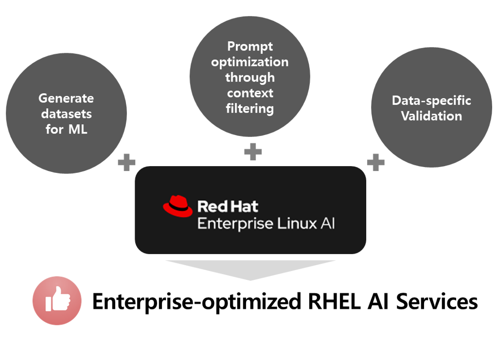
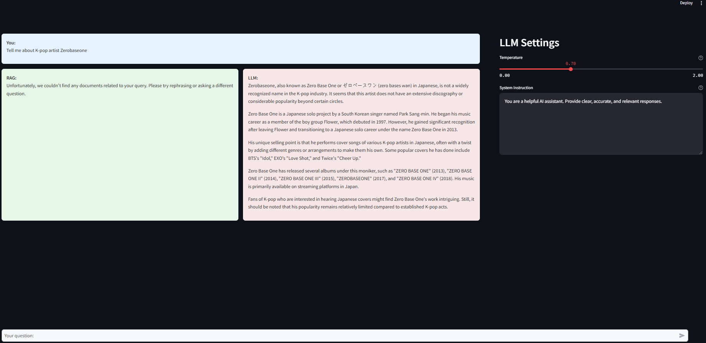
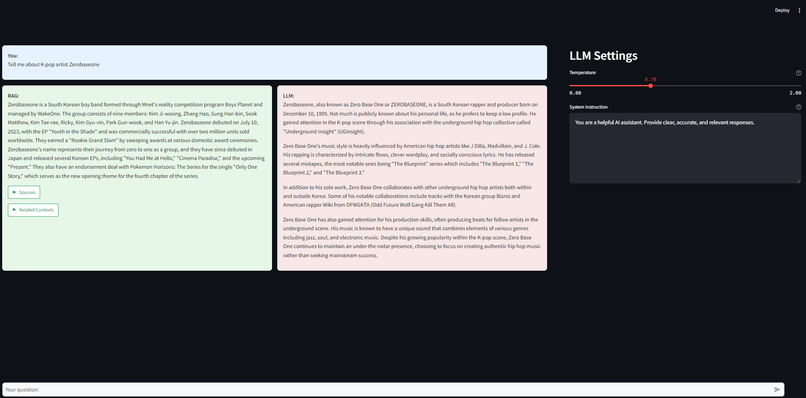
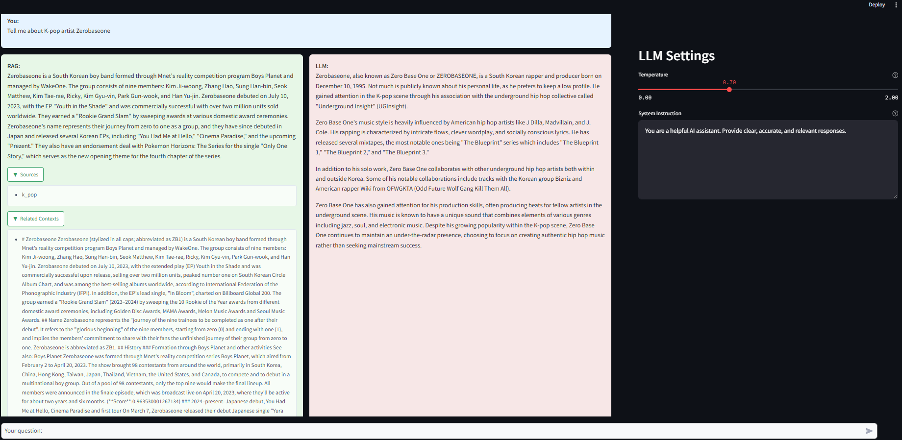
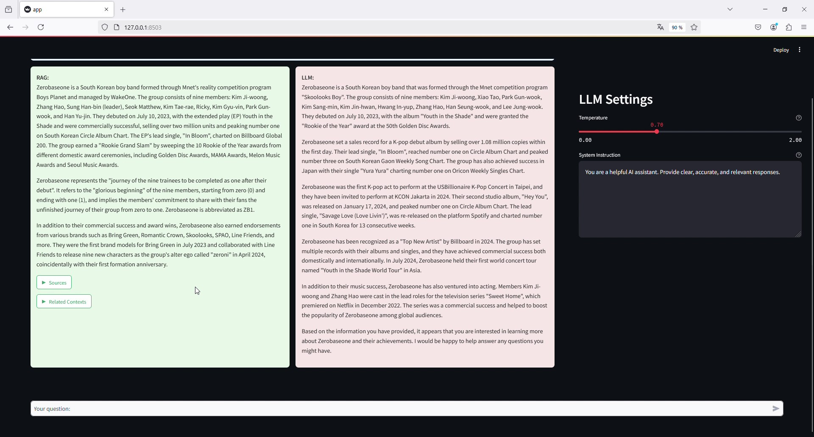
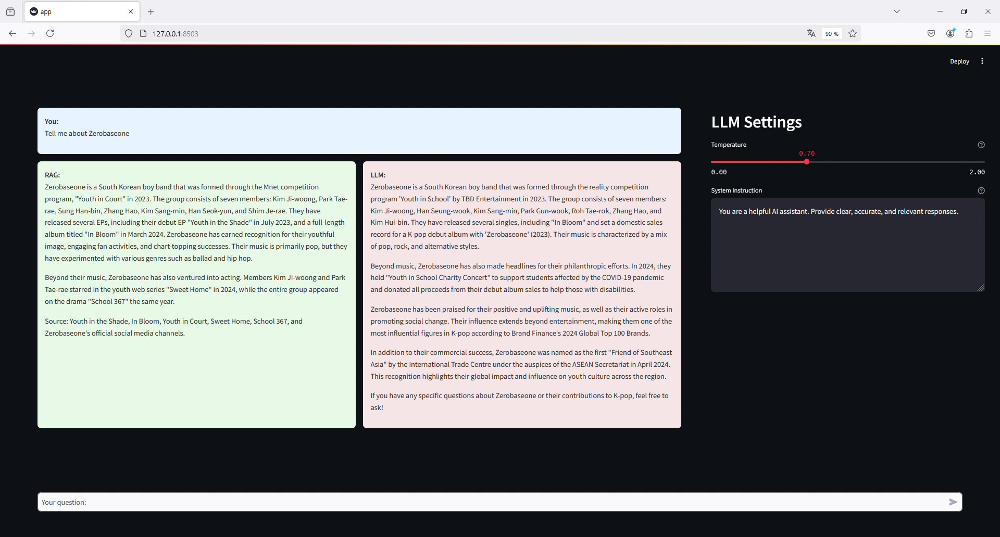
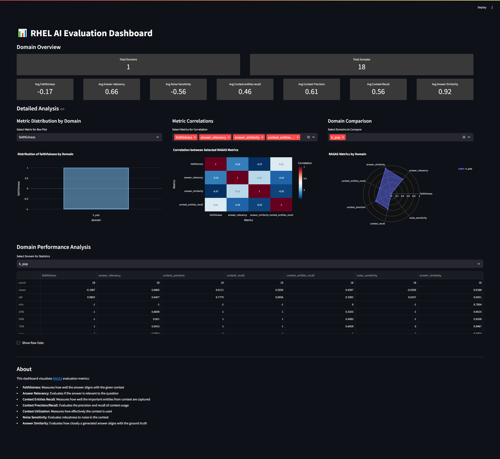

# RHEL AI Pro Suite

## 소개

RedHat Enterprise Linux AI(RHEL AI)는 기업 환경에서 안정적이고 확장 가능한 AI 솔루션을 구축하기 위한 통합 플랫폼입니다. 데이터 분석, 머신러닝, 딥러닝, 컴퓨터 비전, 자연어 처리 등 다양한 AI 워크로드를 지원하며, 안정적인 운영 환경을 통해 AI 모델의 성능을 최적화하고 높은 품질의 서비스를 제공할 수 있습니다. 또한 오픈소스 기술을 기반으로 하여 비용 효율성이 높고 혁신을 가속화할 수 있다는 장점이 있습니다.

하지만 기업에서 RHEL AI를 실제로 활용하는 데에는 몇 가지 어려움이 있습니다. 우선 기업의 데이터를 RHEL AI가 학습할 수 있는 yaml 형식으로 변환하는 과정에서 많은 시간과 리소스가 소요됩니다. 또한 기업의 데이터는 실시간으로 빠르게 축적되는 반면, LLM의 학습 속도가 이를 따라가지 못해 최신 정보와의 격차가 발생하게 됩니다. 더불어 RHEL AI에서 제공하는 현재의 검증 도구들은 일반적인 벤치마크 테스트 위주로 구성되어 있어, LLM이 기업의 고유한 데이터를 얼마나 정확하게 학습했는지 평가하기가 쉽지 않습니다.

이러한 한계를 극복하고 RHEL AI를 더욱 효율적으로 활용할 수 있도록 RHEL AI Pro Suite를 새롭게 선보입니다.

## RHEL AI Pro Suite의 특장점



### 1. 학습 데이터 자동 생성
RHEL AI Pro Suite 솔루션은 RAG 기술을 기반으로 하며, 기업의 데이터를 Vector DB에 저장하면 자동으로 yaml 형식으로 변환해주는 기능을 제공합니다.
### 2. 지능적인 질의 처리
RHEL AI Pro Suite는 LLM이 이미 학습한 내용에 대해서는 context 없이 직접 질의하여 네트워크 비용을 줄이고 높은 성능을 제공합니다. 반면 LLM이 아직 학습하지 않은 내용에 대해서는 context를 포함하여 질의함으로써 정확도를 확보하고 최신 정보에 대응할 수 있습니다.
### 3. 기업 데이터에 특화된 검증
RHEL AI Pro Suite는 기업 데이터에 특화된 검증 도구를 제공하여, LLM이 기업 데이터를 얼마나 잘 학습했는지 정확하게 평가할 수 있습니다. 이러한 특징들을 통해 RHEL AI 기반의 RAG 솔루션으로서 차별화된 가치를 제공합니다.

## 시스템 요구 사항
- 32GB 이상의 메모리
- 500GB 이상의 스토리지
- Linux system (tested on Fedora)
- InstructLab v0.21.0(RHEL AI 1.3)
- Podman 최신 버전
- Elasticsearch 8.14 이상

## 설치
> [!NOTE] 
> 아래 설치 가이드는 CPU 기반의 단일 장비에 RHEL AI, Elasticsearch, RHEL AI Pro Suite이 모두 설치되는 것을 가정합니다.

### 1. InstructLab 설치
1. 만약 InstructLab이 설치되어 있지 않다면, [InstructLab 설치 가이드](https://github.com/instructlab/instructlab?tab=readme-ov-file#-getting-started)나 [RHEL AI 설치 가이드](https://docs.redhat.com/en/documentation/red_hat_enterprise_linux_ai/1.2/html-single/installing/index)를 참조하여 설치하십시오.

2. 설치 후 InsturctLab을 CPU 환경으로 초기화합니다.
    ```bash
    (venv) $ ilab config init
    ```
    아래는 초기화 명령 후 출력되는 log의 예시 입니다.
    ```
    ----------------------------------------------------
            Welcome to the InstructLab CLI
    This guide will help you to setup your environment
    ----------------------------------------------------

    Please provide the following values to initiate the environment [press Enter for defaults]:
    Path to taxonomy repo [/home/user/.local/share/instructlab/taxonomy]:
    Path to your model [/home/user/.cache/instructlab/models/granite-7b-lab-Q4_K_M.gguf]:

    Generating config file and profiles:
        /home/user/.config/instructlab/config.yaml
        /home/user/.local/share/instructlab/internal/system_profiles

    We have detected the INTEL CPU profile as an exact match for your system.

    --------------------------------------------
        Initialization completed successfully!
      You're ready to start using `ilab`. Enjoy!
    --------------------------------------------
    ```

3. 본 예제에서는 `granite-7b-lab-Q4_K_M.gguf`, `mistral-7b-instruct-v0.2.Q4_K_M.gguf`, `instructlab/granite-7b-lab` 모델을 사용하기 때문에, 해당 모델의 리포지토리, 모델 및 Hugging Face 토큰을 지정합니다.
Hugging Face 토큰에 대한 자세한 내용은 [여기](https://huggingface.co/docs/hub/en/security-tokens)에서 확인할 수 있습니다.

    ```bash
    (venv) $ ilab model download
    (venv) $ HF_TOKEN=<YOUR HUGGINGFACE TOKEN GOES HERE> ilab model download --repository -- instructlab/granite-7b-lab
    ```
    다운로드된 모델들은 아래와 같이 확인 할 수 있습니다.
    ```
    (venv) $ ilab model list
    +--------------------------------------+---------------------+---------+
    | Model Name                           | Last Modified       | Size    |
    +--------------------------------------+---------------------+---------+
    | granite-7b-lab-Q4_K_M.gguf           | 2024-12-02 21:09:02 | 3.8 GB  |
    | merlinite-7b-lab-Q4_K_M.gguf         | 2024-12-02 21:37:35 | 4.1 GB  |
    | instructlab/granite-7b-lab           | 2024-12-03 11:07:34 | 12.6 GB |
    | mistral-7b-instruct-v0.2.Q4_K_M.gguf | 2024-11-07 16:24:00 | 4.1 GB  |
    +--------------------------------------+---------------------+---------+
    ```

1. 다음 커맨드를 통해 config.yaml 편집 모드로 진입합니다.
    ```bash
    (venv) $ ilab config edit
    ```
    설정에서 작업마다 모델이 아래와 같이 지정되었는지 확인합니다.
    ```yaml
    chat:
        model: ~/.cache/instructlab/models/granite-7b-lab-Q4_K_M.gguf
    generate:
        model: ~/.cache/instructlab/models/mistral-7b-instruct-v0.2.Q4_K_M.gguf
        teacher:
            model_path: ~/.cache/instructlab/models/mistral-7b-instruct-v0.2.Q4_K_M.gguf
    serve:
        model_path: ~/.cache/instructlab/models/granite-7b-lab-Q4_K_M.gguf
    train:
        model_path: ~/.cache/instructlab/models/instructlab/granite-7b-lab
    ```

> [!NOTE]
> 해당 장비 사양에 맞게 generate.num_cpus 값(Default: 10)을 수정하면 합성 데이터 생성시 더 좋은 성능을 기대할 수 있습니다.

### 2. Vector Database 설치

> [!IMPORTANT]
> RHEL AI Pro Suite는 현재 Elasticsearch만을 Vector DB로 지원합니다.

> [!NOTE]
> 아래 설치 가이드는 Podman용 Elasticsearch 8.15.4 버전을 기준으로 작성되었습니다. 보다 다양한 설치 방법은 [공식 가이드 문서](https://www.elastic.co/guide/en/elasticsearch/reference/current/setup.html)를 참고하세요.

1. 만약 podman이 설치되어 있어 있지 않다면 container-tools meta-package를 설치합니다.
    ```bash
    $ sudo dnf install container-tools
    ```

2. Elasticsearch 이미지 다운로드 및 실행
    ```bash
    $ podman pull docker.elastic.co/elasticsearch/elasticsearch:8.15.4
    $ podman run -d --name elasticsearch --memory 2048m -p 9200:9200 -p 9300:9300 -e "discovery.type=single-node" -e "xpack.security.enabled=false" docker.elastic.co/elasticsearch/elasticsearch:8.15.4
    ```

3. 다음 명령을 통해 Elasticsearch 구동 여부를 확인할 수 있습니다.

    ```bash
    $ curl -XGET http://localhost:9200
    ```

    아래와 같은 응답이 나온다면 Elasticsearch가 정상적으로 구동되고 있는 것입니다.

    ```json
    {
    "name" : "62a77893ad83",
    "cluster_name" : "docker-cluster",
    "cluster_uuid" : "sp1FzENTTV-0hgmKbUhBMQ",
    "version" : {
        "number" : "8.15.4",
        "build_flavor" : "default",
        "build_type" : "docker",
        "build_hash" : "4ec7e3608de63c104724277ebfa8dc7b84685f48",
        "build_date" : "2024-11-07T09:35:45.535387784Z",
        "build_snapshot" : false,
        "lucene_version" : "9.11.1",
        "minimum_wire_compatibility_version" : "7.17.0",
        "minimum_index_compatibility_version" : "7.0.0"
    },
    "tagline" : "You Know, for Search"
    }
    ```

> [!CAUTION]
> Elasticsearch를 상업용으로 활용하기 위해서는 라이선스 구매가 필요할 수 있습니다. 자세한 내용은 [공식 가이드 문서](https://www.elastic.co/subscriptions)를 참고하세요.

> [!CAUTION]
> 사용자 보안이 필요한 서비스는 xpack.security 설정이 필요합니다. 자세한 내용은 [공식 가이드 문서](https://www.elastic.co/guide/en/elasticsearch/reference/current/security-settings.html#general-security-settings)를 참고하세요.

### 3. RHEL AI Pro Suite 설치

> [!CAUTION]
> RHEL AI Pro Suite의 python 가상환경과 RHEL AI의 ilab python 가상환경을 분리하십시오. 동일 환경으로 module들을 설치할 경우 충돌이 발생합니다.

> [!NOTE]
> The following steps in this document use Python venv for virtual environments. However, if you use another tool such as pyenv or Conda Miniforge for managing Python environments on your machine continue to use that tool instead. Otherwise, you may have issues with packages that are installed but not found in your virtual environment.

1. Fedora Linux에 설치하는 경우 다음 명령을 실행하여 C++, Python 3.10 또는 3.11 및 기타 필요한 도구를 설치하십시오.

    ```bash
    sudo dnf install gcc gcc-c++ make git python3.11 python3.11-devel git-lfs yq
    ```

2. RHEL AI Pro Suite repository를 clone합니다

    ```bash
    $ cd ~
    $ git clone https://github.com/s-core/rhel-ai-pro-suite.git
    $ cd rhel-ai-pro-suite
    ```
    
3. 가상환경 구축 및 필요 모듈 설치

    ```bash
    $ python3.11 -m venv --upgrade-deps raps
    $ source raps/bin/activate
    (raps) $ python -m pip install -r ./requirements.txt
    ```

4. config/configuration_example.yml를 복사하여 config/configuration.yml 생성

    ```bash
    (raps) $ cp config/configuration_example.yml config/configuration.yml
    ```

5. (Optional) 만약 동일 장비가 아닌 별도 환경에서 RHEL AI와 Elasticsearch가 구동 중이라면, 해당 환경에 맞게 config/configuration.yml를 수정하십시오.

## Tutorial

> [!NOTE]
> RHEL AI와 RHEL AI Pro Suite는 병렬로 구동됩니다. 따라서 해당 Tutorial은 RHEL AI 조작용 터미널과 RHEL AI Pro Suite 조작용 터미널을 각각 활성화하시면 더 편리하게 시스템을 조작할 수 있습니다.

### 1. (데이터 삽입 전) RAG와 LLM의 답변 비교
1. 설치를 완료하셨다면 다음 명령을 통해 ilab의 LLM Server를 구동합니다.

    ```bash
    (venv) $ ilab model serve
    ```

    다음과 같은 메시지가 출력되면 정상적으로 구동된 것입니다.

    ```
    ...
    INFO 2024-11-26 15:54:58,978 instructlab.model.backends.llama_cpp:194: After application startup complete see http://127.0.0.1:8000/docs for API.
    ```

2. (다른 터미널에서) RHEL AI Pro Suite의 RAG 서버를 구동합니다.

    ```bash
    $ cd ~/rhel-ai-pro-suite
    $ source raps/bin/activate
    (raps) $ python main.py
    ```

    다음과 같은 메시지가 출력되면 정상적으로 구동된 것입니다.

    ```
    ...
    INFO:     Application startup complete.
    INFO:     Uvicorn running on http://0.0.0.0:8888 (Press CTRL+C to quit)
    ```

3. 브라우저에서 http://localhost:8888/demo 에 접속 후 chat_playground를 선택합니다.

4. chat_playground에서 다음 질문을 입력하고 결과를 비교해봅니다.

    ```
    Tell me about K-pop artist Zerobaseone
    ```

    Zerobaseone은 유명한 K-POP 아티스트이지만 RAG는 대답을 못하고, LLM은 Hallucination을 발생시킬 것입니다.

    

> [!NOTE]
> ~/rhel-ai-pro-suite/configs/configuration.yaml에 demo.chat_playground 설정이 변경되지 않았다면, http://localhost:8503 으로 바로 접속 가능합니다.

> [!NOTE]
> 최초 구동시, embedding model과 re-ranker model을 다운로드가 발생하여 수십분의 로딩시간이 발생할 수 있습니다.

> [!NOTE]
> 대답 못하는 결과만 보고 RAG의 성능에 대해 의심할 것입니다. 하지만 RAG는 지극히 정상적으로 동작하고 있습니다. 이는 RAG가 지식 소스로 등록된 문서에서 관련 정보를 찾지 못했기 때문입니다. 이후 단계에서 지식 소스를 등록하고 다시 질문해보면 RAG가 정확한 답변을 제공할 것입니다.

### 2. (데이터 삽입 후) RAG와 LLM 간 답변 비교
1. (필요시 터미널을 더 띄워) 다음 명령을 통해 Data를 삽입해봅시다. 

    ```bash
    $ cd ~/rhel-ai-pro-suite
    $ curl -X 'POST' \
        'http://localhost:8888/v1/documents/files' \
        -H 'accept: application/json' \
        -H 'Content-Type: multipart/form-data' \
        -F 'file=@demo/sample_data/zb1.md' \
        -F 'domain=k-pop'
    ```

    결과는 다음과 같습니다.

    ```
    {"messsage":"success","index_name":"ai_odyssey_demo_documents-000001"}
    ```

2. 데이터가 잘 삽입되었는지는 Vector DB에서 확인 가능합니다.

    ```bash
    $ curl -XGET 'http://localhost:9200/ai_odyssey_demo_documents-000001/_search?size=0&pretty'
    ```

    결과는 다음과 같습니다.

    ```
    {
        ...
        "hits" : {
            ...
            "value" : 5,
            ...
        }
    }
    ```

    문서가 5개의 chunk로 나눠져서 잘 들어간 것을 확인할 수 있습니다.

3. chat_playground에서 이전과 동일한 질문을 입력하고 결과를 비교해봅니다.
    ```
    Tell me about K-pop artist Zerobaseone
    ```
    RAG는 Vector DB에 삽입된 지식 소스 기반으로 답변을 잘 생성하며, LLM은 여전히 Hallucination이 발생하는 것을 확인 할 수 있습니다. 

    

    답변 아래 Context 버튼을 눌러 확인해보면 답변에 기반이 되는 지식을 확인 할 수 있습니다.

    

> [!NOTE]
> RAG의 가치는 데이터만 있으면 즉각적으로 보다 정확한 답변을 생성할 수 있다는데 있습니다. 하지만 프롬프트 상에 많은 데이터가 전달되어 네트워크 비용과 LLM 연산 증가를 발생시키는 단점도 존재합니다. LLM은 이러한 질문에 대답하기 위해서는 학습이 필요합니다.

### 3. LLM 학습용 데이터 만들기
#### RHEL AI Pro Suite로 qna.yaml 생성하기 
RHEL AI 학습을 위한 taxonomy tree를 만드는 것은 원래 많은 시간과 노력이 필요한 작업입니다. 하지만 RHEL AI Pro Suite를 사용하면 이 과정을 크게 단순화할 수 있습니다.
이 도구는 Vector DB의 데이터를 활용해서 taxonomy에 필요한 qna.yaml 파일을 자동으로 생성합니다. 사용자는 두 가지를 먼저 결정해야 됩니다.

* domain - 어떤 영역의 데이터를 생성할지
* testset_size - 몇 개의 질문/답변 쌍을 만들지

그리고 나서 RHEL AI의 texonomy 요건을 만족할 조건들을 추가 입력해야 합니다.

* qna_yaml - qna.yaml에 지켜야하는 요건에 대한 내용입니다.
    * version - "3"으로 고정되어 있습니다.
    * created_by - 작성자 정보입니다.
    * repo, commit, patterns - 데이터가 올라가 있는 repository, commit, 파일명 정보입니다.

> [!IMPORTANT]
> InstructLab용 학습 데이터는 Git 저장소에 호스팅되어야 합니다. [공식 문서](https://docs.redhat.com/ko/documentation/red_hat_enterprise_linux_ai/1.2/html/creating_a_custom_llm_using_rhel_ai/customize_taxonomy_tree#adding_knowledge)를 참조하세요.

이렇게 API를 호출하면 ilab에서 자동으로 합성 데이터가 포함된 qna.yaml 파일을 생성합니다. 사용자는 복잡한 제약조건을 고려해서 직접 파일을 만들 필요 없이, 생성된 파일을 taxonomy의 적절한 위치에 배치하기만 하면 됩니다.

```bash
$ mkdir -p ~/.local/share/instructlab/taxonomy/knowledge/arts/music/k-pop
$ curl -X POST http://localhost:8888/v1/qna/generate -H "Content-Type: application/json" -d '{
    "target_model": "", 
    "testset_size": 3,
    "domain": "k-pop",
    "document_index_name": "ai_odyssey_demo_documents-000001",
    "testset_index_name": "ai_odyssey_demo_testset-000001",
    "qna_yaml": {
        "version": 3,
        "created_by": "wonseop",
        "repo": "https://github.com/s-core/rhel-ai-pro-suite",
        "commit": "f2975127aff4ce301c47d24a9a42e7865caa17b8",
        "patterns": ["demo/sample_data/zb1.md"]
    }
}' > ~/.local/share/instructlab/taxonomy/knowledge/arts/music/k-pop/qna.yaml
```

결과는 다음과 같습니다.

```
  % Total    % Received % Xferd  Average Speed   Time    Time     Time  Current
                                 Dload  Upload   Total   Spent    Left  Speed
100 13633    0 13197    0   436      4      0 --:--:--  0:45:43 --:--:--  3
```

> [!IMPORTANT]
> 현재 Taxonomy에서 Skill 영역은 지원하지 않으며, 모든 데이터는 Knowledge 영역에 위치해야 합니다.
> Vector DB 안에 적어도 5개 이상의 chunk가 존재해야 하며, testset_size 값은 3 이상이어야 합니다.

> [!WARNING]
> 해당 과정은 Intel(R) Core(TM) i7-14700 CPU 기준으로 1시간 정도 소요됩니다.

> [!NOTE]
> RHEL AI의 Taxonomy에 대해 보다 자세한 내용은 [공식 문서](https://docs.redhat.com/ko/documentation/red_hat_enterprise_linux_ai/1.2/html/creating_a_custom_llm_using_rhel_ai/customize_taxonomy_tree#customize_taxonomy_tree)를 참조하세요.

#### InsturctLab으로 taxonomy 검증하기
이제 생성된 yaml을 다음 명령을 통해 검증할 수 있습니다.

```bash
$ ilab taxonomy diff
knowledge/arts/music/k-pop/qna.yaml
Taxonomy in /home/rocky/.local/share/instructlab/taxonomy is valid :)
```

> [!IMPORTANT]
> 양자화 모델를 활용하여 qna.yaml을 생성할 경우, 수정사항이 발생할 수 있습니다. 이 경우, 가이드에 따라 qna.yaml을 수정하고 다시 검증해야 합니다.

#### InsturctLab으로 합성 데이터 생성하기
RHEL AI는 qna.yaml을 기반으로 LLM이 학습할 수 있는 합성 데이터를 생성해냅니다.
이를 통해 상대적으로 적은 수의 qna.yaml 만으로 LLM 학습 품질을 높이는 것이 가능합니다.
다음은 CPU 환경을 고려하여 teacher 모델없이 합성 데이터를 적게 만들어 빠르게 합성 데이터를 생성하는 명령입니다.

```bash
$ ilab data generate --pipeline simple --sdg-scale-factor 5 --enable-serving-output 
```

> [!NOTE]
> 합성 데이터 개수를 많이 생성할수록 더 나은 LLM 학습 품질을 기대할 수 있습니다. 보다 자세한 내용은 [공식 문서](https://docs.redhat.com/ko/documentation/red_hat_enterprise_linux_ai/1.2/html/creating_a_custom_llm_using_rhel_ai/generate_sdg)를 참조하세요.

> [!WARNING]
> 해당 과정은 Intel(R) Core(TM) i7-14700 CPU 기준으로 30분 정도 소요됩니다.

### 4. InstuctLab으로 LLM 학습시키기
InstuctLab에서는 생성된 합성 데이터를 활용하여 LLM의 학습을 지원합니다.
다음은 CPU 환경을 고려하여 최소한으로 학습을 수행하는 명령입니다.

```bash
(venv) $ ilab model train --pipeline simple --enable-serving-output
```

> [!WARNING]
> 해당 과정은 Intel(R) Core(TM) i7-14700 CPU 기준으로 48 시간 이상 소요됩니다. 가급적 GPU 환경에서 수행하시길 권장합니다.

### 5. 데이터 학습 여부 체크하기
#### InstuctLab에서 사용 모델 변경하기
이제 학습된 LLM이 우리가 원하는 대로 학습되었는지 확인해봅시다.
우선 학습된 LLM으로 변경하여 서비스를 다시 시작합니다.

```bash
(venv) $ ilab model serve --model-path ~/.local/share/instuctlab/checkpoints/ggml-model-f16.gguf
```

chat_playground에서 다시 Zerobaseone에 대해 다시 질의합시다.

```
Tell me about K-pop artist Zerobaseone
```

이제 LLM만으로도 이 boy band에 대해 답변하는 것을 확인 할 수 있습니다.



> [!NOTE]
> 답변 품질이 낮을 경우, 학습 데이터 수를 늘리거나, epoch값 또는 반복횟수를 증가시켜 재학습을 시도해보세요.

#### RHEL AI Pro Suite에서 context 필터링하기
학습된 LLM이 적용되었지만 여전히 RAG는 질의시마다 수많은 context를 전송하고 있습니다.
네트워크 비용이나 LLM의 최대 처리 token 수를 생각하면 이는 상당히 비효율적입니다.
다음 API를 호출하여 Vector DB의 해당 domain 지식들을 필터링합시다.

```bash
curl -X PATCH http://localhost:8888/v1/documents \
    -H "Content-Type: application/json" -d '{
        "filter": {
            "domain": "k-pop"
        },
        "update": {
            "status": "trained"
        }
    }'
```

이제 질의에 대해 Vector DB에서 검색은 발생하지만, RAG는 검색된 내용이 이미 학습하였다고 판단하여 해당 Context를 LLM에 전달하지 않습니다. 이를 통해 LLM이 보다 신속하게 답변을 생성하는 것을 확인 할 수 있습니다.
또한 chat_playground에서 이전과 동일한 질의시, RAG에서도 더 이상 Context를 전송하지 않으며 답변도 잘 생성하는 것을 확인할 수 있습니다.




### 6. 학습 데이터 기반으로 모델 검증하기
RHEL AI Pro Suite의 가장 큰 특징은 학습 데이터 기반으로 모델을 검증할 수 있다는 점입니다. 일반적인 벤치마크를 통한 검증은 학습된 LLM이 다른 LLM과 전반적인 성능을 비교하는 측면에서는 의미가 있지만, 학습시킨 데이터 대상으로 LLM이 얼마나 잘 학습되었는지 판단하기 어렵습니다. 하지만 RHEL AI Pro Suite는 다양한 지표(metric)를 통하여 학습된 LLM과 RAG 시스템의 검색 품질과 답변 품질을 측정할 수 있습니다.

먼저 비평가(Critic) LLM을 다른 장비에서 serving합니다(본 예제에는 `mistral-7b-instruct-v0.2.Q4_K_M.gguf`를 사용합니다.).

> [!CAUTION]
> 비평가 LLM을 동일 장비에서 사용하는 것은 권장하지 않습니다. 가급적 다른 장비에서 비평가 LLM을 운용하십시오.

> [!CAUTION]
> 비평가 LLM은 최대 처리 token 수가 128K 이상이고, 모델 크기가 70B 파라미터 이상인 대용량 고성능 모델 사용을 권장합니다. 양자화 모델을 사용할 경우, 연산 성능이 낮아 잘못된 지표값이 전달될 수 있습니다.

```bash
(venv) $ ilab model serve --model-path ~/.cache/instructlab/models/mistral-7b-instruct-v0.2.Q4_K_M.gguf

```
이 후 다음 API를 호출하여 학습 데이터 기반으로 모델을 검증합니다.

```bash
$ curl -X 'POST' \
  'http://localhost:8888/v1/qna/evaluate' \
  -H 'accept: application/json' \
  -H 'Content-Type: application/json' \
  -d '{
    "critic_llm": {
        "host": "http://localhost:8001",
        "headers": {
            "Content-Type": "application/json"
        }

    },
    "domain": "k-pop"
}'
```

API 호출 후에는 evaluation_dashboard를 실행하여 각종 metric을 확인 가능합니다.



> [!NOTE]
> RHEL AI Pro Suite의 검증은 [RAGAS v0.1.21](https://docs.ragas.io/en/v0.1.21/)을 기반으로 합니다. 사용 지표에 대한 내용은 [여기](https://docs.ragas.io/en/v0.1.21/concepts/metrics/index.html)를 참조하십시오.

## API Endpoints
API에 대한 내용은 [여기](docs/rest_api.md)를 참조하십시오.

## Configuration
Configuration에 대한 내용은 [여기](docs/configuration.md)를 참조하십시오.

## License
RHEL AI Pro Suite is distributed under AGPL-3.0.
